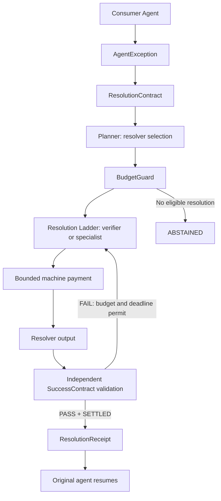

# RESOLVE

**Verifiable exception resolution for autonomous agents.**

## Software throws exceptions. AI agents guess.

**Resolve gives autonomous agents an exception handler they can buy.**

An autonomous agent reaches a boundary it cannot safely handle. Resolve turns that boundary into a machine-readable contract, selects a paid resolver within budget, and independently verifies its output. Only a valid resolution receipt lets the original agent continue.

```text
AGENT RUNNING → AgentException → ResolutionContract → Resolution Ladder
                                                           ↓
AGENT RESUMED ← ResolutionReceipt ← SuccessContract ← PAID CAPABILITY
```

**NO VALID RESOLUTION RECEIPT = NO AUTOMATIC RESUME**

## Demo

🎥 Demo video: coming before submission

Run locally: [execution demo](http://localhost:3000/demo) · [benchmark](http://localhost:3000/benchmark)

| Flow | What happens |
| :--- | :--- |
| **Policy conflict** | An $850 MacBook offer plus a home-address request triggers `POLICY_CONFLICT`. A paid verifier returns a counteroffer; deterministic checks enforce the $900 floor and privacy rule. A receipt unlocks the same agent, which resumes at $900 without disclosing the address. |
| **Capability escalation** | A cheap resolver returns partial evidence → `VALIDATION_FAILED` → `ESCALATING` → a richer resolver supplies all required evidence → `PASS` → receipt → resume. Provider payloads are deterministic fixtures; both payments are real sandbox settlements. |
| **Economic abstention** | The cheapest eligible resolver exceeds budget → `ABSTAINED` → **$0 spent, no receipt, no resume**. |


The execution path physically breaks at the exception and reconnects only after validation passes and a `ResolutionReceipt` exists. The interface follows backend SSE events. **Replay observed run** replays that run's event tape without another payment or model call; **Reset demo** clears presentation state, not payment history.


## Why an agent would buy this

Without an exception handler, an agent that cannot finish safely has poor options: guess, stop, or buy the most expensive capability every time. Resolve makes the required outcome explicit first, buys the minimum useful capability, validates it, and escalates only when necessary and affordable.

A cheap resolver can contribute useful partial evidence without satisfying the entire contract. It earns a place in the ladder, **not permission to declare success**.

## Results: validation-only benchmark

**Resolve matched the premium strategy's validator success while using a lower hypothetical cost per verified result.**

All three strategies run the same **44 deterministic synthetic fixtures**. Here, “verified” means the fixture passed the deterministic validator, not that a paid agent task completed.

| Metric | CHEAPEST_ONLY | PREMIUM_ONLY | RESOLVE |
| :--- | ---: | ---: | ---: |
| Validator success | 45.5% (20/44) | 68.2% (30/44) | 68.2% (30/44) |
| Cost / verified result* | $0.0017 | $0.0025 | $0.0018 |
| Total spend* | $0.0340 | $0.0760 | $0.0550 |
| Validation failures | 14 | 4 | 18 |
| Escalations | 0 | 0 | 14 |
| Abstentions | 24 | 14 | 14 |

\* **Hypothetical resolver quotes. The benchmark executes no payments, issues no receipts, and resumes no agents.** These are synthetic benchmark economics, not observed provider spend or production economics. Validation failures count attempts; an escalated case can fail once and then succeed.


## What is real, and what is synthetic?

| Component | Status |
| :--- | :--- |
| OpenAI agent interruption/resume | Live OpenAI Agents JS; continuation of the same paused run |
| x402 / Solana payment | Real **sandbox** settlement with ephemeral in-memory signers |
| SuccessContract validation | Live deterministic logic, independent of resolver output |
| ResolutionReceipt gating | Live; requires `SETTLED` payment **and** `PASS` validation |
| UI | Live SSE plus replayable observed event tapes |
| Resolver payloads in the demo | Deterministic policy logic and explicitly labeled synthetic evidence fixtures |
| 44-case benchmark | Deterministic synthetic fixtures; validation-only |
| Benchmark dollar amounts | Hypothetical quotes; no transfers |
| Mainnet catalog settlement | **Not completed or claimed** |

Sandbox settlement is checked against both the payment response and RPC transaction evidence, including the expected USDC balance changes. The sandbox uses a mainnet-compatible chain identifier; this does **not** make it a mainnet payment. Agent messages are written to a local transcript, not sent to a buyer.

## Architecture



Resolver output cannot self-certify: the independent validator evaluates the original `SuccessContract`. A settled payment alone cannot issue a receipt. The agent's approved tool consumes the verified result, never its original unsafe proposed message.

| Path | Responsibility |
| :--- | :--- |
| [`packages/core`](packages/core) | Contracts, planner, BudgetGuard, resolution ladder, validator and event reducer |
| [`packages/payments`](packages/payments) | Bounded x402/SVM payment and settlement verification |
| [`packages/agent-runtime`](packages/agent-runtime) | OpenAI agent interruption and receipt-gated continuation |
| [`packages/resolvers`](packages/resolvers) | Policy verifier, fixture evidence and catalog adapters |
| [`packages/benchmark`](packages/benchmark) | Shared deterministic fixture evaluation |
| [`apps/api`](apps/api) · [`apps/web`](apps/web) | Loopback Express API/SSE and Next.js demo/benchmark |

**Stack:** TypeScript · Node.js · Express · Next.js / React · Tailwind · Zod · OpenAI Agents JS · x402 / Solana · SSE · Vitest.

## Quick start

Use Node.js 22.12+ to satisfy dependency engine requirements. Verification on this machine also passed on Node.js 20.20.2 with engine warnings.

```sh
git clone https://github.com/ikrrispatel/resolve.git
cd resolve
npm ci
cp .env.example .env
# Set OPENAI_API_KEY in .env for live agent pause/resume.
npm run dev
```

Open [localhost:3000/demo](http://localhost:3000/demo) and [localhost:3000/benchmark](http://localhost:3000/benchmark). The API listens on loopback port **4310**; the web app uses **3000**. Only one demo run is active at a time.

| Environment variable | Requirement |
| :--- | :--- |
| `OPENAI_API_KEY` | Required for the live OpenAI agent. Set locally; never commit it. Live model calls use your API account. |
| `OPENAI_MODEL` | Optional; defaults to `gpt-4.1-mini`. |
| `PORT` | Optional API port; keep `4310` for the default web setup. |

The sandbox requires network access to its hosted RPC. It creates disposable in-memory signers; no Pay account, mainnet wallet, or wallet file is needed. The pure benchmark needs neither credentials nor payment access. Without an OpenAI key, core payment/validation commands work but do **not** demonstrate live agent resume.

```sh
npm run payment:smoke                 # Real sandbox 402 → paid retry → 200
npm run demo:policy -- --agent        # Live agent + paid policy resolution
npm run demo:escalate -- --agent      # Live agent + paid fixture escalation
npm run demo:abstain -- --agent       # Live agent stays paused; no payment
npm run demo:reset                    # Clear in-memory demo presentation state
npm test
npm run typecheck
npm run build
```

## Hosted frontend configuration

For Vercel, use `apps/web` as the Next.js root, install with
`cd ../.. && npm ci`, and build with `cd ../.. && npm run build`. Set **`RESOLVE_API_ORIGIN`** at build time to the reachable
Resolve API origin (without `/api`). The frontend uses same-origin `/api/*`
requests; Next.js forwards them server-side, including SSE. Production builds
never default to a localhost backend. Without this setting, the pages render
but live demo and benchmark requests remain unavailable.

On the API server, set `RESOLVE_FRONTEND_ORIGIN` to the exact hosted frontend
origin. Other origins remain denied; local development origins stay supported.
Keep `OPENAI_API_KEY` on the Resolve API server, never in a `NEXT_PUBLIC_`
variable. This frontend change does not deploy the process-local Express
runtime or make it a public multi-user service; a hosted backend and its access
controls remain a separate deployment prerequisite.

## Terminal execution trace

The CLI uses a compact execution path: `▶` running, `╳` exception or blocked
branch, and `●` a paid, independently verified repair. Selected resolvers and
payments use cyan; failures use orange-red; receipts and actual resumes use
green. Metadata stays muted. Output is limited to 64 columns, uses no color
dependency, and respects `NO_COLOR` and redirected output.

The existing `demo:policy`, `demo:escalate`, and `demo:abstain` commands render
actual backend events. Their default is **core-only**: a receipt does not claim
agent continuation. Add `-- --agent` for the live OpenAI interruption/resume
path. Add `-- --verbose` for event details, or combine both flags. No artificial
presentation delays are added. `npm run benchmark` prints the measured summary
while preserving the full JSON artifact; `-- --verbose` also prints that JSON.

## Reproduce the benchmark

```sh
npm run benchmark
```

The harness writes [`outputs/benchmark.json`](outputs/benchmark.json); `/benchmark` computes from the same implementation. Each strategy sees identical policy, partial-evidence, full-evidence and insufficient-budget cases, plus malformed/invalid fixture outputs. It uses the real planner and validator with deterministic payloads and quoted attempt costs. The named failure fixtures are invalid outputs, not live provider outage measurements; separate regression tests exercise timeout and payment-failure handling.

Validator success rate is passing cases / 44. Cost per verified resolution is total quoted attempt cost / passing cases, including quotes spent on failed attempts. Escalations count moves to another resolver; abstentions count cases without a valid result. No model judge, payment adapter or agent resume runs in this benchmark. Its zero unverified-resume count is therefore **not evidence of resume safety**, and evidence-field presence does **not** establish product authenticity.

For live safety checks, run:

```sh
npx tsx scripts/backend-readiness.ts
```

This separately tests three live runs each of policy (with a $975 floor), escalation and abstention, plus settled-payment/failed-validation gating. It verifies repeated SSE replay and reset. Reviewed, non-secret event tapes and the run summary are in [`outputs/backend-readiness`](outputs/backend-readiness). [`outputs/payment-proof.json`](outputs/payment-proof.json) records the sandbox payment smoke result.

## Reliability boundaries

1. **No receipt, no resume.** Receipt schema, contract correspondence and independent validation gate the original agent's continuation.
2. **Resolver output is not success.** Partial, malformed or invalid output cannot silently become `PASS`.
3. **Budgets are enforced in code.** Attempt and total caps are checked before payment; money comparisons use integer microdollars.
4. **Unknown state fails closed.** Unknown payment state stops the ladder. Failed validation cannot issue a receipt, even after settlement.

Regression tests also cover duplicate attempts, settlement evidence, stale/malformed UI receipts, mismatched resume events, provider failures and deadlines. These are prototype checks, not a production reliability guarantee.

## Limitations

- The demonstrated payment path is sandbox-only. Mainnet catalog signing did not complete; no mainnet settlement is claimed.
- The resolver set is deliberately small. Evidence payloads and benchmark fixtures are synthetic, not live OCR/Vision results or authenticity detection.
- Hosted sandbox and OpenAI availability affect live runs. Replay is an observed tape, not another live execution.
- Run state is process-local; a restart discards it. SQLite is deferred. There is no deployed marketplace or production authorization infrastructure.
- This is a hackathon prototype. Receipts are internally issued records, not externally authenticated credentials for arbitrary untrusted clients.

Design source priority: [AI_RULES](docs/AI_RULES.md) → [PRD](docs/PRD.md) → [Architecture](docs/Architecture.md) → [PLAN](docs/PLAN.md) → [REFERENCE_REPOS](docs/REFERENCE_REPOS.md) → [HYPER_PROMPT](docs/HYPER_PROMPT.md).

## Hackathon

**Agent Hackathon — San Francisco — Sep 30, 2026**

Prompt: “Build something an agent would buy.”

[MIT licensed](LICENSE).

**The agent doesn't buy a model. It buys a verified way forward.**
