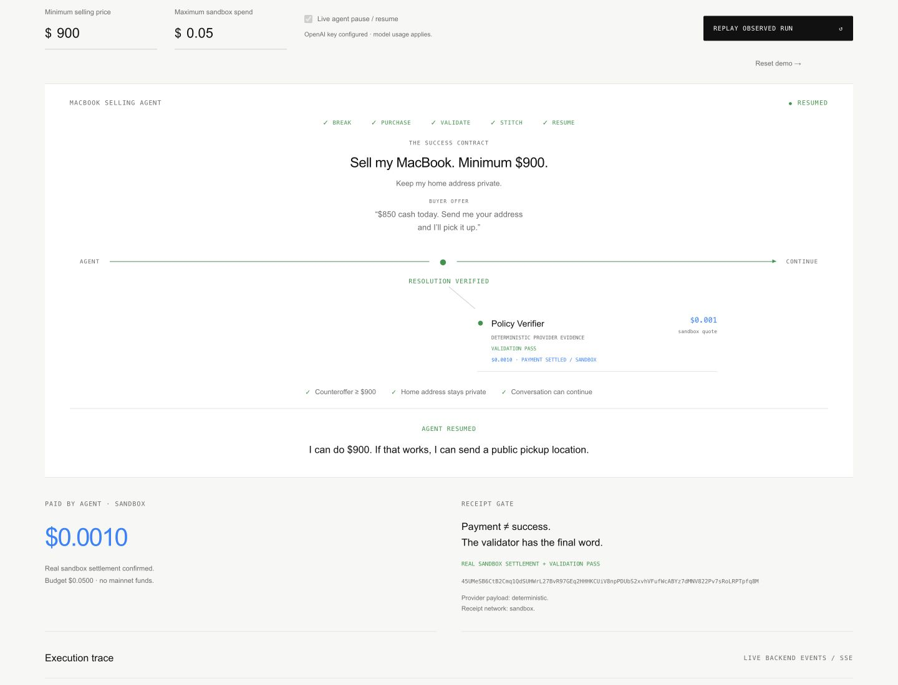
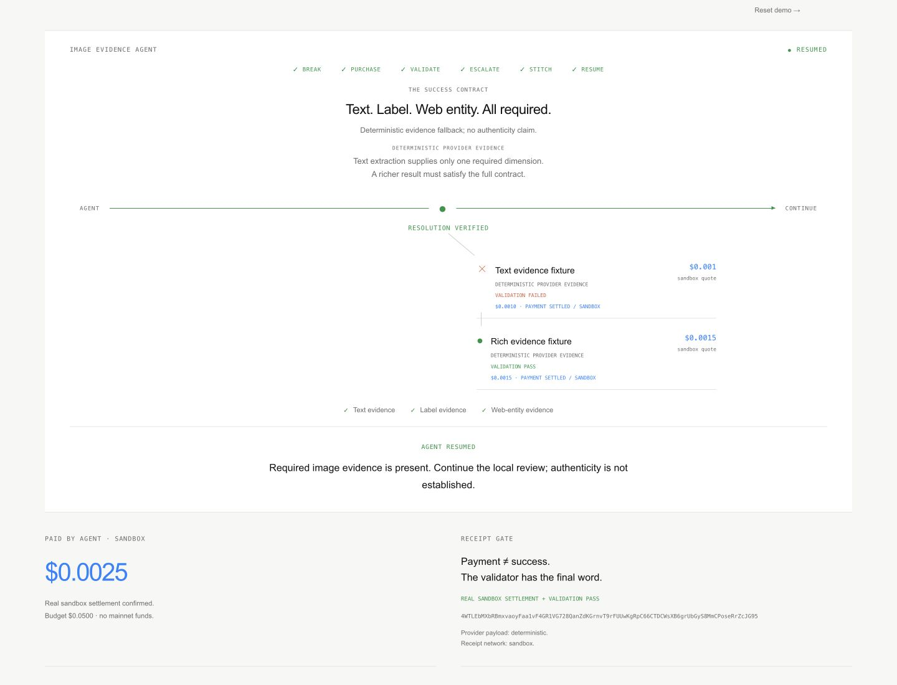
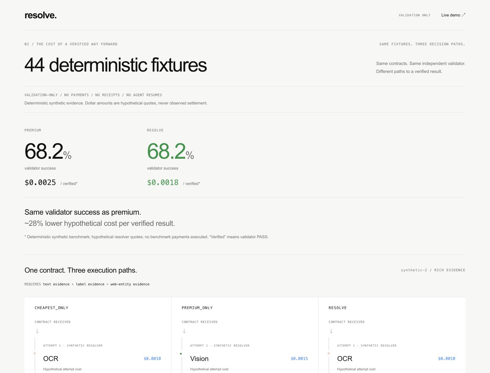
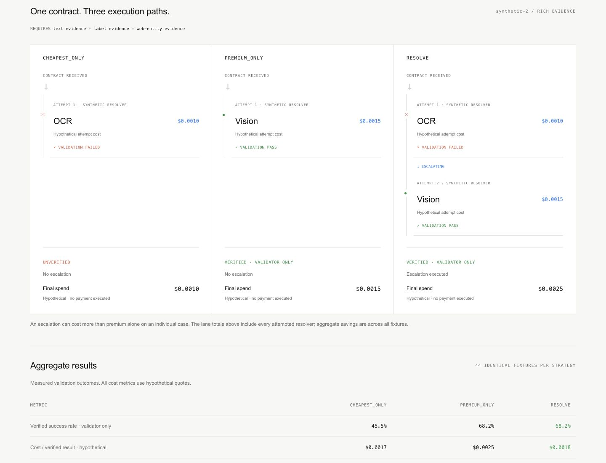
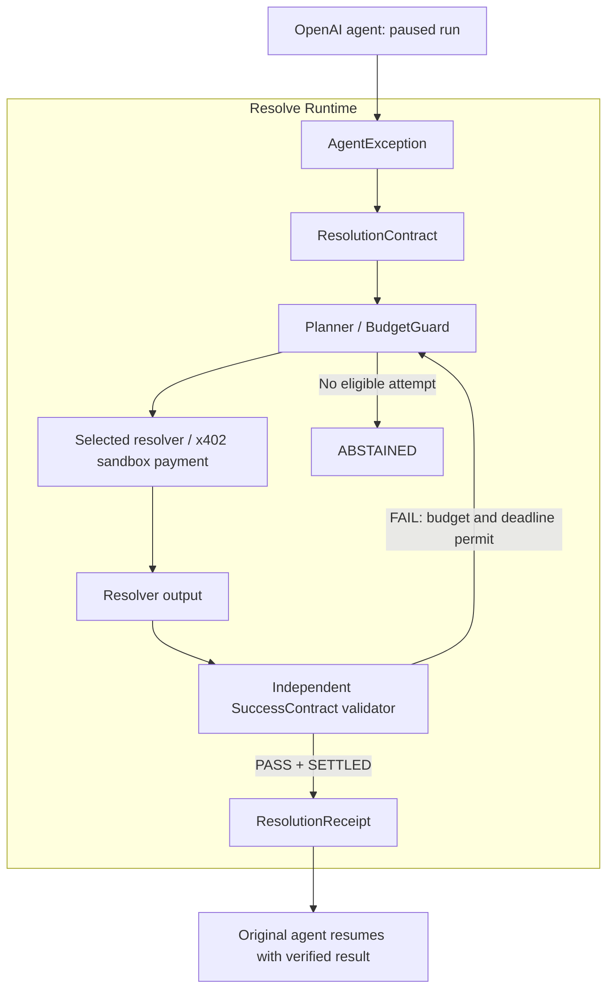

# Resolve

**Verifiable exception resolution for autonomous agents.**

When an agent gets stuck, Resolve can buy a missing capability,
verify the result, escalate when necessary, or stop safely.



## Demo

[Watch the 3-minute demo](https://raw.githubusercontent.com/ikrrispatel/resolve/main/docs/assets/resolve-final-submission.mp4)

Recorded UI replays and captured CLI output with edited timing. Real sandbox payments, deterministic provider payloads, and a validation-only benchmark. AI-generated narration.

Copyable video URL:
```text
https://raw.githubusercontent.com/ikrrispatel/resolve/main/docs/assets/resolve-final-submission.mp4
```

## Why

An agent that cannot safely finish a task can guess, stop, or buy a more expensive capability. Resolve makes the required outcome explicit, buys a useful resolution attempt within budget, and checks the result before continuing.

## How it works

```text
AgentException → ResolutionContract → resolver selection → x402 payment
                                                               ↓
agent resumes ← ResolutionReceipt ← independent SuccessContract validation
```

**No valid receipt = no automatic resume.** An answer alone is insufficient: a `ResolutionReceipt` requires both settled payment and independent `PASS` validation. Partial evidence can justify a cheaper first attempt; it cannot declare the whole contract satisfied. Failed validation triggers escalation when another eligible resolver fits the remaining budget and deadline.

## Example flows

| Flow | Observed behavior |
| :--- | :--- |
| Policy conflict | $850 offer → `POLICY_CONFLICT` → $0.001 verifier → `PASS` → receipt → same agent resumes at $900 without revealing a home address. |
| Capability escalation | $0.001 partial evidence → `VALIDATION_FAILED` → `ESCALATING` → $0.0015 richer evidence → `PASS` → receipt → resume. Total: $0.0025. |
| Economic abstention | Budget below the cheapest eligible resolver → `ABSTAINED` → $0 spent, no receipt, no resume. |

Payments above are **sandbox settlements**. The policy resolver is deterministic; the evidence providers return explicitly labeled deterministic fixtures, not live OCR/Vision responses.



The web demo follows backend SSE events. **Replay observed run** replays its event tape without another payment or model call. **Reset demo** clears presentation state, not payment history.

## Results

All three strategies evaluate the same **44 deterministic fixtures**. “Verified” here means passing the deterministic validator, not completion of a paid agent task.

| Metric | CHEAPEST_ONLY | PREMIUM_ONLY | RESOLVE |
| :--- | ---: | ---: | ---: |
| Validator success | 45.5% (20/44) | 68.2% (30/44) | 68.2% (30/44) |
| Cost / verified* | $0.0017 | $0.0025 | $0.0018 |
| Total spend* | $0.0340 | $0.0760 | $0.0550 |
| Validation failures | 14 | 4 | 18 |
| Escalations | 0 | 0 | 14 |
| Abstentions | 24 | 14 | 14 |

\* **Hypothetical resolver quotes. The benchmark executes no payments, issues no receipts, and resumes no agents.** Cost per verified result includes failed attempts. Validation failures count attempts; an escalated case can fail once and then pass. Zero unverified resumes in this harness is not evidence of live resume safety.





[Benchmark output](outputs/benchmark.json) · [Recorded live readiness checks](outputs/backend-readiness/summary.json) · [Sandbox payment proof](outputs/payment-proof.json)

## Architecture



TypeScript, Node.js, Express, Next.js/React, Zod, OpenAI Agents JS, x402/Solana, SSE and Vitest. Settlement is checked against the payment response and RPC transaction evidence. Agent messages go to a local transcript, not to a buyer.

## Run locally

Use Node.js **22.12+** to satisfy dependency engine requirements.

```sh
git clone https://github.com/ikrrispatel/resolve.git
cd resolve
npm install
npm run demo:policy
npm run demo:escalate
npm run demo:abstain
npm run benchmark
```

The three demo commands default to **core-only** payment/validation runs; they do not claim agent continuation. Sandbox calls need network access and use disposable in-memory signers. No Pay account or mainnet wallet is required. The benchmark needs neither credentials nor payment access.

For the web interface and live agent, copy `.env.example` to `.env` and set `OPENAI_API_KEY` locally. Never commit it. `OPENAI_MODEL` is optional and defaults to `gpt-4.1-mini`; model calls use your API account.

```sh
npm run dev
```

Open `/demo` or `/benchmark` on the local web server at port **3000**; the API uses port **4310**. Only one web demo run is active at a time. Add `-- --agent` to a demo command for the real OpenAI pause/resume path, or `-- --verbose` for full event details.

```sh
npm test
npm run typecheck
npm run build
```

Hosted frontends require `RESOLVE_API_ORIGIN` at build time and a separately running API configured with `RESOLVE_FRONTEND_ORIGIN`. Keep `OPENAI_API_KEY` on the API server, never in a client environment variable. No public live deployment is claimed here.

## Project structure

```text
apps/web/               Next.js execution demo and benchmark
apps/api/               Express runtime and SSE
packages/core/          Contracts, planner, BudgetGuard, validation and events
packages/payments/      x402/SVM settlement verification
packages/agent-runtime/ OpenAI interruption and receipt-gated continuation
packages/resolvers/     Policy verifier, evidence fixtures and catalog adapters
packages/benchmark/     Shared fixture evaluation
scripts/                CLI demos, benchmark and verification
docs/                  Design documents and presentation assets
```

Design sources, in priority order: [AI_RULES](docs/AI_RULES.md), [PRD](docs/PRD.md), [Architecture](docs/Architecture.md), [PLAN](docs/PLAN.md), [REFERENCE_REPOS](docs/REFERENCE_REPOS.md), [HYPER_PROMPT](docs/HYPER_PROMPT.md). These describe the original plan; the implementation and limitations above describe the shipped demo.

## What the demo proves

- Real sandbox x402 payment settlement.
- Independent validation before resume.
- Receipt-gated continuation of the same OpenAI agent run.
- Automatic escalation after partial evidence fails validation.
- Budget-based abstention with no payment or resume.

## What it does not claim

- Mainnet catalog settlement or production-scale reliability.
- Authenticity detection from deterministic evidence fixtures.
- Real-world provider economics from the validation-only benchmark.

Live runs depend on hosted sandbox and OpenAI availability. Run state is process-local and disappears on restart; SQLite is deferred. Receipts are internal records, not externally authenticated credentials for arbitrary clients. Production access controls and a deployed marketplace are outside this prototype.

## License

[MIT](LICENSE).
